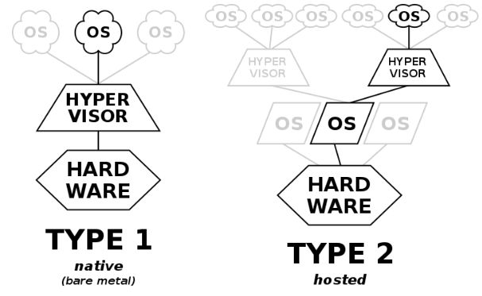

## 🦥 본문

# ▪ 개념
   -호스트 컴퓨터에서 다수의 운영 체제(operating system)를 동시에 실행하기 위한 논리적 플랫폼(platform)을 말한다. 가상화 머신 모니터 또는 가상화 머신 매니저(영어: virtual machine monitor 또는 virtual machine manager, 줄여서 VMM)라고도 부른다.

# ▪ 유형
  
  
